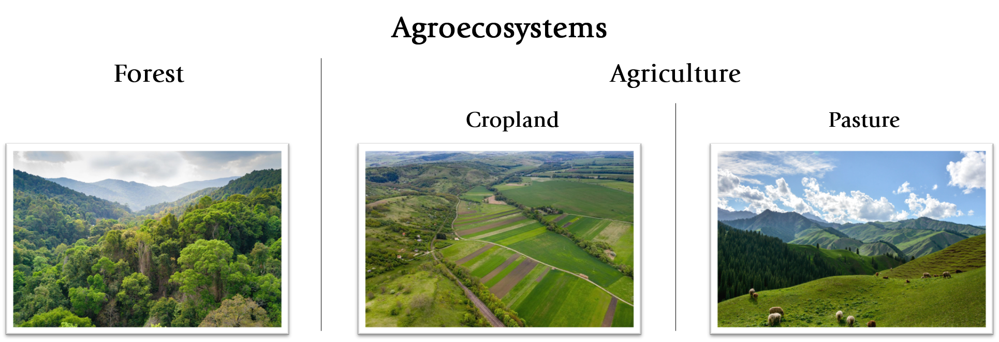
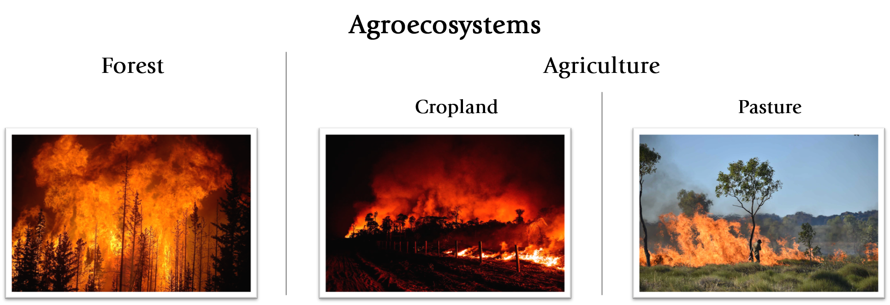
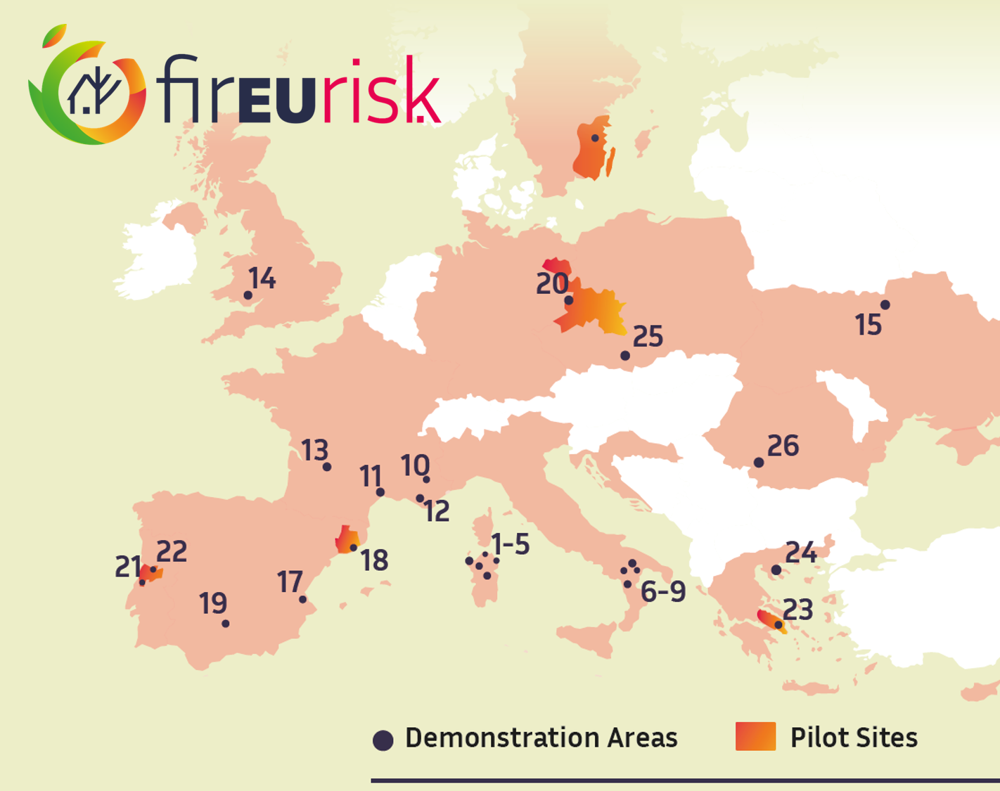
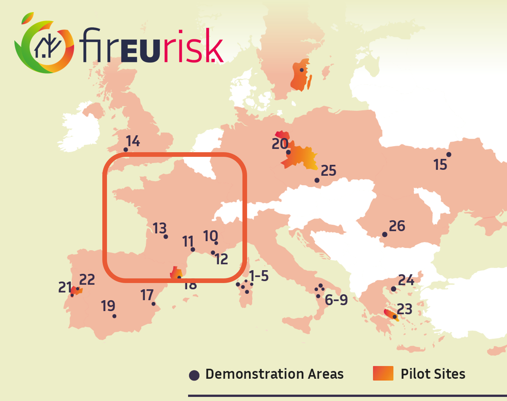
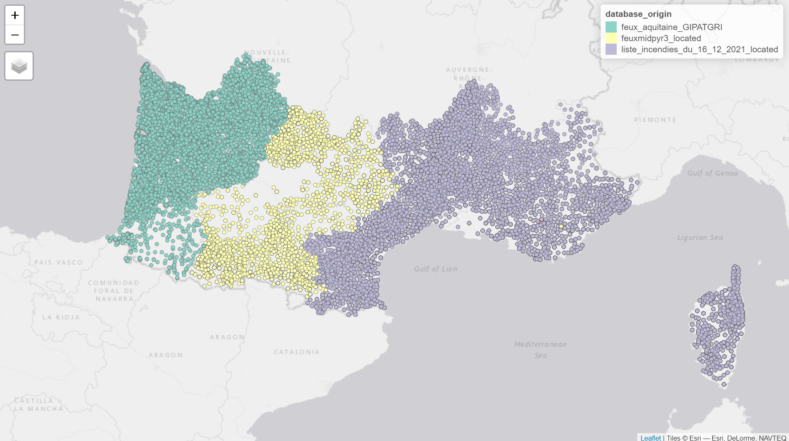

```{r setup, include=FALSE}
options(htmltools.dir.version = FALSE)
knitr::opts_chunk$set(fig.align = "center", 
                      message = FALSE, 
                      warning = FALSE, 
                      paged.print = FALSE)

```

# Model study

**Agroecosystem** : Ecosystem that has been modified by humans to use some of the organic matter it produces, usually for food.

--



---

# Model study

**Agroecosystem** : Ecosystem that has been modified by humans to use some of the organic matter it produces, usually for food.




--

-> Specific fire regime : Seasonality, Burned area, Fire behavior and Prescription 

---
class: center

# Study area



---
class: center

# Study area



---
# Land cover data
.left-column[<video data-autoplay width="650" controls autoplay>
  <source src="scripts/JDD_files/figure-html/LandCover_sattelite.mp4" type="video/mp4">
</video>]
.right-column[<video data-autoplay width="1000" controls autoplay>
  <source src="scripts/JDD_files/figure-html/FarEarth_compressed.mp4" type="video/mp4">
</video>]

---
# Sattelite sensor

.left-column[<video data-autoplay width="650" controls autoplay>
  <source src="scripts/JDD_files/figure-html/MODIS_sattelite_compressed.mp4" type="video/mp4">
</video>]

.right-column[<video data-autoplay width="650" controls autoplay>
  <source src="scripts/JDD_files/figure-html/VIIRS.mp4" type="video/mp4">
</video>]
---
# Firefighter alert


---
#What about agricultural fires ?

**Land cover data** 
.pull-left[.pull-left[<video data-autoplay width="1000" controls autoplay>
  <source src="scripts/JDD_files/figure-html/FarEarth_compressed.mp4" type="video/mp4">
</video>
- Elapsed time between 2 date : 6, 12 or 24 hours


- Color differences pre and post-fire


- Harvested crop similar to burned area
]]

---
#What about agricultural fires ?

**Land cover data** 
.pull-left[.pull-left[<video data-autoplay width="1000" controls autoplay>
  <source src="scripts/JDD_files/figure-html/FarEarth_compressed.mp4" type="video/mp4">
</video>
- Elapsed time between 2 date : 6, 12 or 24 hours


- Color differences pre and post-fire


- Harvested crop similar to burned area
]
.pull-right[<video data-autoplay width="1000" controls autoplay>
  <source src="scripts/JDD_files/figure-html/VIIRS.mp4" type="video/mp4">
</video>]
]

---
#What about agricultural fires ?

**Land cover data** 
.pull-left[.pull-left[<video data-autoplay width="1000" controls autoplay>
  <source src="scripts/JDD_files/figure-html/FarEarth_compressed.mp4" type="video/mp4">
</video>
- Elapsed time between 2 date : 6, 12 or 24 hours


- Color differences pre and post-fire


- Harvested crop similar to burned area
]

.pull-right[<video data-autoplay width="1000" controls autoplay>
  <source src="scripts/JDD_files/figure-html/VIIRS.mp4" type="video/mp4">
</video>]]

.pull-right[
.pull-left[

]]

---
#What about agricultural fires ?


.pull-left[.pull-left[
**Land cover data** 
<video data-autoplay width="1000" controls autoplay>
  <source src="scripts/JDD_files/figure-html/FarErth_compressed.mp4" type="video/mp4">
</video>
- Elapsed time between 2 date : 6, 12 or 24 hours


- Color differences pre and post-fire


- Harvested crop similar to burned area
]

.pull-right[
**Sattelite sensor**
<video data-autoplay width="1000" controls autoplay>
  <source src="scripts/JDD_files/figure-html/VIIRS.mp4" type="video/mp4">
</video>]]

.pull-right[
**Firefighter alert**
.pull-left[

]

.pull-right[
**Data mining !**
]]

