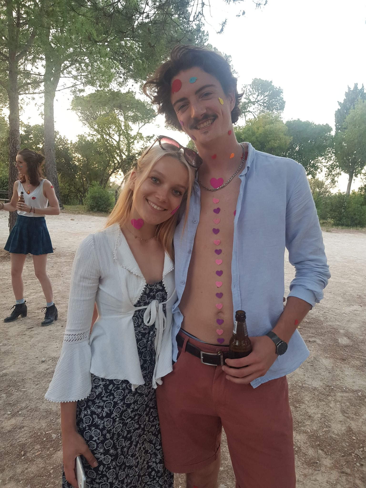

```{r setup, include=FALSE}
options(htmltools.dir.version = FALSE)
knitr::opts_chunk$set(fig.align = "center", 
                      message = FALSE, 
                      warning = FALSE, 
                      paged.print = FALSE)

```

# Model study

**Agroecosystem** : Ecosystem that has been modified by humans to use some of the organic matter it produces, usually for food.

--


---

# Model study

**Agroecosystem** : Ecosystem that has been modified by humans to use some of the organic matter it produces, usually for food.


--

-> Specific fire regime : Seasonality, Burned area, Fire behavior and Prescription 

---
class: center

# Study area


---
class: center

# Study area


---
# Land cover data
.left-column[<video data-autoplay loop muted width="650" controls autoplay loop muted >
  <source src="scripts/JDD_files/figure-html/LandCover_sattelite.mp4" type="video/mp4">
</video>]
.right-column[<video data-autoplay width="1000" controls autoplay loop muted>
  <source src="scripts/JDD_files/figure-html/FarEarth_compressed.mp4" type="video/mp4">
</video>]

---
# Sattelite sensor

.left-column[<video data-autoplay width="650" controls autoplay loop muted>
  <source src="scripts/JDD_files/figure-html/MODIS_sattelite_compressed.mp4" type="video/mp4">
</video>]

.right-column[<video data-autoplay width="650" controls autoplay loop muted>
  <source src="scripts/JDD_files/figure-html/VIIRS.mp4" type="video/mp4">
</video>]
---
# Firefighter alert


---


#What about agricultural fires ?


.pull-left[.pull-left[
**Land cover data** 
<video data-autoplay width="1000" controls autoplay loop muted>
  <source src="scripts/JDD_files/figure-html/FarEarth_compressed.mp4" type="video/mp4">
</video>
- Inaccurate fire Contour


- Color differences pre and post-fire


- Harvested crop similar to burned area
]]

---
#What about agricultural fires ?


.pull-left[.pull-left[
**Land cover data** 
<video data-autoplay width="1000" controls autoplay loop muted>
  <source src="scripts/JDD_files/figure-html/FarEarth_compressed.mp4" type="video/mp4">
</video>
- Inaccurate fire Contour


- Color differences pre and post-fire


- Harvested crop similar to burned area
]

.pull-right[
**Sattelite sensor**
<video data-autoplay width="1000" controls autoplay loop muted>
  <source src="scripts/JDD_files/figure-html/VIIRS.mp4" type="video/mp4">
</video>
- 1 point = several fires


- 1 fire = several points


- Elapsed time between 2 date : 6, 12 or 24 hours
]]

---
#What about agricultural fires ?


.pull-left[.pull-left[
**Land cover data** 
<video data-autoplay width="1000" controls autoplay loop muted>
  <source src="scripts/JDD_files/figure-html/FarEarth_compressed.mp4" type="video/mp4">
</video>
- Inaccurate fire Contour


- Color differences pre and post-fire


- Harvested crop similar to burned area
]

.pull-right[
**Sattelite sensor**
<video data-autoplay width="1000" controls autoplay loop muted>
  <source src="scripts/JDD_files/figure-html/VIIRS.mp4" type="video/mp4">
</video>
- 1 point = several fires


- 1 fire = several points


- Elapsed time between 2 date : 6, 12 or 24 hours
]]

.pull-right[
**Firefighter alert**
.pull-left[

- Any kind of fire

- Poor estimation of Burned area
]]

---
#What about agricultural fires ?


.pull-left[.pull-left[
**Land cover data** 
<video data-autoplay width="1000" controls autoplay loop muted>
  <source src="scripts/JDD_files/figure-html/FarEarth_compressed.mp4" type="video/mp4">
</video>
- Inaccurate fire Contour


- Color differences pre and post-fire


- Harvested crop similar to burned area
]

.pull-right[
**Sattelite sensor**
<video data-autoplay width="1000" controls autoplay loop muted>
  <source src="scripts/JDD_files/figure-html/VIIRS.mp4" type="video/mp4">
</video>
- 1 point = several fires


- 1 fire = several points


- Elapsed time between 2 date : 6, 12 or 24 hours
]]

.pull-right[
**Firefighter alert**
.pull-left[

- Any kind of fire

- Poor estimation of Burned area
]

.pull-right[
***
**Data mining !**
***

]]

---
# Global dataset
**12453** observations from 2000 to 2021, with :

- 8408 agricultural fires
  - 6008 field fires
  - 2400 building fires
- 1577 pastoral fires


5 types of variables :

- Date (day/month/year)
- Municipality of event (Name and INSEE code)
- Location of municipality (Latitude and Longitude)
- Vegetation type
- Data source

Additional variables for agricultural fires :
- Burned area for field fires
- Storage place with estimated Dry mass burned for building fires


---
class: center
# Spatial overview


---
# Temporal dynamics and Seasonality


---
# Temporal dynamics and Seasonality

---
#Work in progress
## Compare current database with Sattelite sensor
.pull-left[
]
.pull-right[
<video data-autoplay width="650" controls autoplay loop muted>
  <source src="scripts/JDD_files/figure-html/MODIS_sattelite_compressed.mp4" type="video/mp4">
</video>
]

---
#Work in progress
.pull-left[
## Estimate missing burned area
Climatic data from ERA5-Land :
- Relative Humidity
- Wind Speed
- Mean Temperature
]

.pull-right[
## Carbon footprint estimation
Argicultural data from AGRESTE (national database) 

-> Assess carbon emissions linked to agricultural fires
]
---

# Task for a second Phd Thesis : **Data scraping**


---
class: title-slide-final, 

# Thank you for your attention and enjoy the day!
